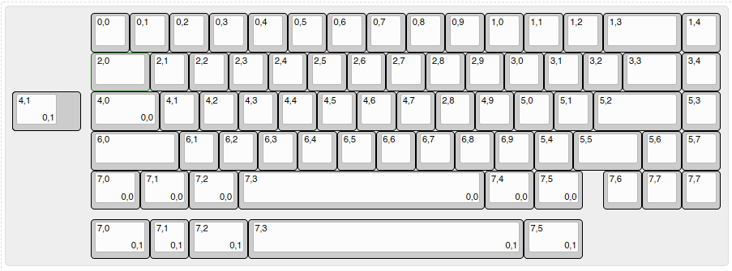

# Namii65
 Open-Source Mechanical Keyboard PCB with 65% layout and using ProMicro as main MCU

# Layout
* 65%
* 2 Bottom Row (Ansi and Tsangan)
* Stepped Capslock

# Firmware
Not Uploaded yet

# Info
This is the v2 of the pcb
